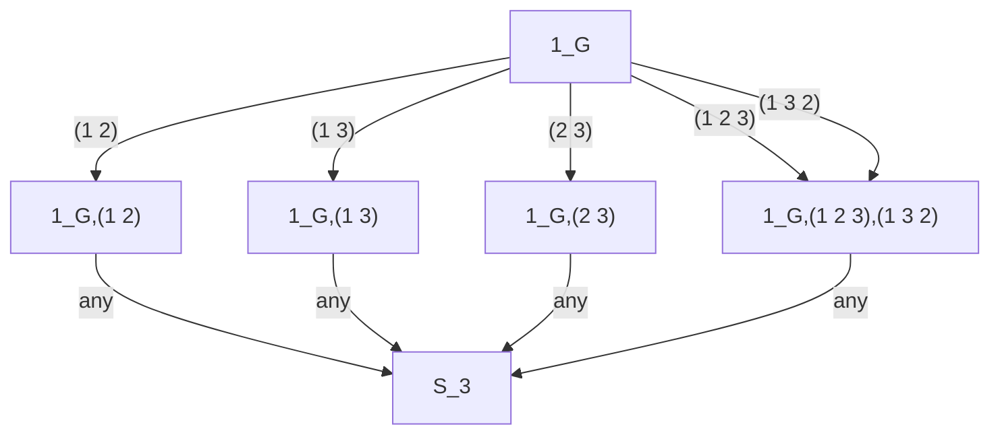
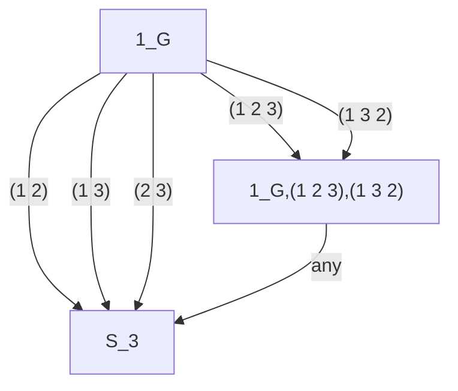
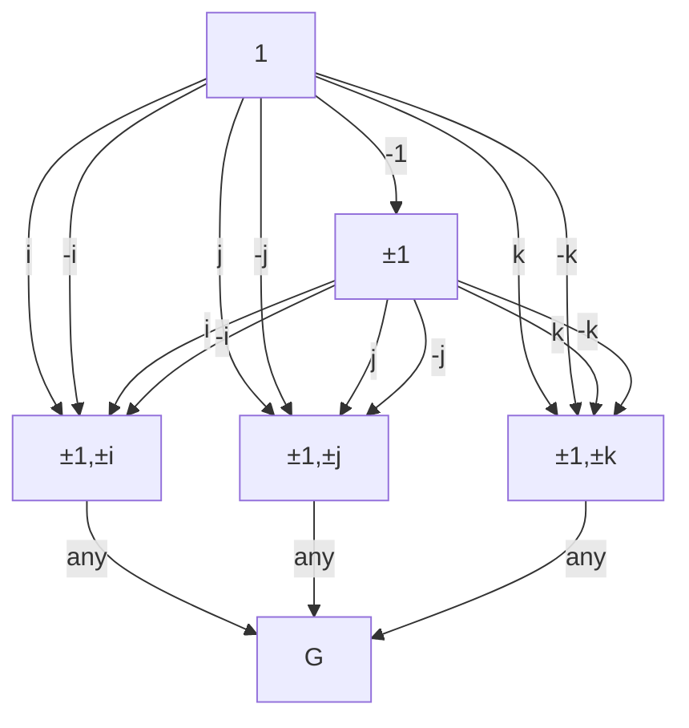

# 代数学1 群論入門

## 2章の演習問題

### 2.8 正規部分群と剰余群

#### 2.8.1

1. $(1\;2) \in H = \mathfrak{S}_3, (1\;4) \in G = \mathfrak{S}_4, (1\;4)(1\;2)(1\;4)^{-1}=(2\;4)\notin H$なので$H$は$G$の正規部分群ではない。
2. 【誤り：$\mathrm{SL}_2(\mathbb{R})$ p.56 命題2.8.4 の場合で書いてた】~~$h \in H=\mathrm{SO}(2), g \in G=\mathrm{GL}_2(\mathbb{R})$で、$\det(ghg^{-1})=\det(g)\det(h)\det(g)^{-1}=1$なので$ghg^{-1}\in H$。すなわち$H$は$G$の正規部分群。~~

※$$h = \begin{pmatrix} 0 & -1\\
 1 & 0
\end{pmatrix} \in H=\mathrm{SO}(2) \\
g = \begin{pmatrix} 1 & 1 \\
 0 & 1
 \end{pmatrix} \in G=\mathrm{GL}_2(\mathbb{R}) \\
g h g^{-1} = \begin{pmatrix} 1 & -2 \\
1 & -1 \end{pmatrix} \notin H$$

$$\begin{pmatrix} 1 & 1\\
-2 & -1 \end{pmatrix}\begin{pmatrix} 1 & -2\\
1 & -1 \end{pmatrix}=\begin{pmatrix} 2 & -3 \\
-3 & 5 \end{pmatrix} \neq I_2$$

3. $$h = \begin{pmatrix} 0 & 1\\
 1 & 0
\end{pmatrix} \in H=\mathrm{GL}_2(\mathbb{R}) \\
g = \begin{pmatrix} 1 & i \\
 0 & 1
 \end{pmatrix} \in G=\mathrm{GL}_2(\mathbb{C}) \\
g h g^{-1} = \begin{pmatrix} i & 2\\
1 & -i \end{pmatrix} \notin H$$ よって$H$は$G$の正規部分群ではない
4. $H=\{ 1, (1 2)(3 4), (1 3)(2 4), (1 4)(2 3) \} \subset G=\mathfrak{S}_4$。演習問題2.3.9(2)より$\mathfrak{S}_4$は$T=\{(1\;2),(1\;2\;3\;4)\}$で生成される。$G$は有限群なのでp.57 命題2.8.7より任意の$x \in T, y \in H$について$xyx^{-1}$が$H$に属するかを調べれば良い。$y=1_G$のときは明らかに$xyx^{-1}\in H$。他の場合は以下のようになるため$xyx^{-1}\in H$。すなわち$H$は$G$の正規部分群となる。
$$(1\;2)(1\;2)(3\;4)(1\;2)^{-1}=(1\;2)(3\;4)\in H\\
(1\;2\;3\;4)(1\;2)(3\;4)(1\;2\;3\;4)^{-1}=(1\;4)(2\;3) \in H\\
(1\;2)(1\;3)(2\;4)(1\;2)^{-1}=(1\;4)(2\;3) \in H\\
(1\;2\;3\;4)(1\;3)(2\;4)(1\;2\;3\;4)^{-1}=(1\;3)(2\;4) \in H\\
(1\;2)(1\;4)(2\;3)(1\;2)^{-1}=(1\;3)(2\;4) \in H\\
(1\;2\;3\;4)(1\;4)(2\;3)(1\;2\;3\;4)^{-1}=(1\;2)(3\;4) \in H\\
$$

| |$1_G$|$(1\;2)(3\;4)$|$(1\;3)(2\;4)$|$(1\;4)(2\;3)$|
|-|-|-|-|-|
|$1_G$|$1_G$|$(1\;2)(3\;4)$|$(1\;3)(2\;4)$|$(1\;4)(2\;3)$|
|$(1\;2)(3\;4)$|$(1\;2)(3\;4)$|$1_G$|$(1\;4)(2\;3)$|$(1\;3)(2\;4)$|
|$(1\;3)(2\;4)$|$(1\;3)(2\;4)$|$(1\;4)(2\;3)$|$1_G$|$(1\;2)(3\;4)$|
|$(1\;4)(2\;3)$|$(1\;4)(2\;3)$|$(1\;3)(2\;4)$|$(1\;2)(3\;4)$|$1_G$|

※↑はクラインの4元群↓と同型

| |$1$|$i$|$j$|$k$|
|-|-|-|-|-|
|$1$|$1$|$i$|$j$|$k$|
|$i$|$i$|$1_G$|$k$|$j$|
|$j$|$j$|$k$|$1$|$i$|
|$k$|$k$|$j$|$i$|$1$|

※$H$の$1,2,3,4$のラベルを置き換えても$H$のままなので対称性があると考えると、$(1\;2),(2\;3),(3\;4)$を持ってきた方が楽

5. $$g = \begin{pmatrix}a & 0 \\ c & d \end{pmatrix} \in G(a\neq 0\land d\neq 0), h=\begin{pmatrix}e & 0 \\ g & e \end{pmatrix} \in H(e\neq 0)$$ として、
$$g h g^{-1} = \begin{pmatrix}a & 0 \\ c & d\end{pmatrix}\begin{pmatrix}e & 0 \\ g & e\\ \end{pmatrix}\begin{pmatrix}\frac{1}{a} & 0 \\ -\frac{c}{ad} & \frac{1}{d} \end{pmatrix} \\
= \begin{pmatrix}ae & 0\\ ce+dg & de\end{pmatrix}\begin{pmatrix}\frac{1}{a} & 0 \\ -\frac{c}{ad} & \frac{1}{d} \end{pmatrix}\\
= \begin{pmatrix}e & 0\\ \frac{dg}{a} & e\end{pmatrix} \in H$$ よって、$H$は$G$の正規部分群。

#### 2.8.2

$H$が指数2の部分群なので$|G/H|=2$。$H$は部分群なので$1_G$を含む。$1_G H$と異なる剰余類に属する元を$k$とすると、$k \notin H$($\because k \in H$ と仮定すると $k \in H = 1_G H$ となり $k$ が $1_G H$ 異なる剰余類に属するという前提と矛盾する)。このとき$1_G H$と異なる剰余類は$k H$と表せ、$|G/H|=2$で、かつ $1_G H \neq k H$であることから $G$の元は $1_G H = H$ か $k H$ のいずれかの剰余類に属する。

補題1. $k H$の任意の$2$元の積は$1_G H = H$に属する

$k H$ に属する任意の$2$元は$h_1, h_2 \in H$として$k h_1, k h_2$と表せる。これらの積 $k h_1 k h_2$ が $1_G H$ に属することを示す。$k h_1 k h_2 \in k H$ と仮定すると、$h_3 \in H$によって $k h_1 k h_2 = k h_3$と表せる。両辺に左から $h_1^{-1} k^{-1}$をかけると$k h_2 = h_1^{-1} h_3 \in H = 1_G H(\because H$が部分群なので積、逆元で閉じている$)$ となり、$k h_2 \in k H$と矛盾する。よって、$k h_1 k h_2 \in 1_G H$。すなわち$k H$の任意の$2$元の積は$1_G H$に属する。

補題2. $k^{-1} \in k H$

$k^{-1} \in 1_G H = H$と仮定すると$H$が逆元で閉じているため$k \in H$となり$k \notin H$と矛盾する。よって$k^{-1} \in k H$。

任意の$g \in G$について、$g \in 1_G H = H$ または $g \in k H$ である。任意の $h \in H$について、$g h g^{-1} \in H$であることを示せば $H$ が正規部分群であることを言える。$g \in H$ の場合は、$H$ が逆元、積で閉じているため明らかに $g h g^{-1} \in H$。$g \in k H$の場合、$h^\prime \in H$によって$g = k h^\prime$と表せるため、$g h g^{-1} = k h^\prime h (k h^\prime)^{-1} = k h^\prime h h^{\prime -1} k^{-1}=(k(h^\prime h h^{\prime -1}))(k^{-1}) \in 1_G H = H(\because$補題より$)$。以上により、$g h g^{-1} \in H$なので$H$は正規部分群となる。

※直和で考えると$G = H + x H = H + H x$ なので $x H = H x$ これが正規部分群の定義と同値

#### 2.8.3 担当

まず$N_1 N_2$が部分群であることを示す。

1. $N_1, N_2$、それぞれが$G$の部分群なので、$1_G \in N_1$ かつ $1_G \in N_2$。よって$N_1 N_2 \ni 1_G 1_G = 1_G$。
2. 任意の $x_1, x_2 \in N_1 N_2$に対して$a_1, a_2 \in N_1$、$b_1, b_2 \in N_2$を用いsて$x_1 = a_1 b_1, x_2 = a_2 b_2$と表せる。このとき$x_1 x_2 = a_1 b_1 a_2 b_2 = a_1 (a_2 a_2^{-1}) b_1 a_2 b_2 = (a_1 a_2)((a_2^{-1} b_1 a_2) b_2) = (a_1 a_2)((a_2^{-1} b_1 (a_2^{-1})^{-1}) b_2) \in N_1 N_2(\because a_1 a_2 \in N_1$ (部分群なので)、$(a_2^{-1} b_1 (a_2^{-1})^{-1}) \in N_2(b \in N_2$で$N_2$が正規部分群なので)、$((a_2^{-1} b_1 (a_2^{-1})^{-1}) b_2) \in N_2(N_2$が部分群で積について閉じているので))
3. 任意のの$x \in N_1 N_2$について$a \in N_1, b \in N_2$を使って$x = a b$と表せる。このとき、$x^{-1} = (ab)^{-1} = b^{-1} a^{-1} = (a^{-1} a) b^{-1} a^{-1} = a^{-1} (a b^{-1} a^{-1}) \in N_1 N_2 (\because a^{-1} \in N_1$($N_1$が逆元について閉じている), $(a b^{-1} a^{-1}) \in N_2(b^{-1} \in N_2$で$N_2$が正規部分群))

1(単位元を含む)、2(積について閉じている)、3(逆元について閉じている)ため、$N_1 N_2$は$G$の部分群である。

任意の $x \in N_1 N_2$ は $a \in N_1, b \in N_2$によって$x = a b$と表せる。$N_1,N_2$が正規部分群なので、任意の$g \in G$について$g a g^{-1} \in N_1$かつ$g b g^{-1} \in N_2$。従って任意の$g \in G$について、$g x g^{-1} = g a b g^{-1} = g a (g^{-1} g) b g^{-1} = (g a g^{-1}) (g b g^{-1}) \in N_1 N_2$となるため、定義に従い$N_1 N_2$は正規部分群である。

※探索ネタ：$ghg^{-1} \in H$ だけだと$H$が部分群であることは言えないか？反例は？
※探索ネタ：$H_1,H_2$が部分群で$H_1 H_2$が正規部分群であるとき$H_1,H_2$はそれぞれ正規部分群になるか？

#### 2.8.4

$\mathfrak{S}_3=\{1_{\mathfrak{S}_3}, (1\;2), (1\;3), (2\;3), (1\;2\;3), (1\;3\;2) \}$。p.32 命題2.3.13(2)を踏まえて組み合わせを考えると、$\mathfrak{S}_3$の部分群は、$\{1_{\mathfrak{S}_3}\}, \{1_{\mathfrak{S}_3}, (1\;2)\}, \{1_{\mathfrak{S}_3}, (1\;3)\}, \{1_{\mathfrak{S}_3}, (2\;3)\}, \{1_{\mathfrak{S}_3}, (1\;2\;3), (1\;3\;2)\}, \mathfrak{S}_3$。(単位元、単位元と$(1\;2),(1\;3),(2\;3),(1\;2\;3),(1\;3\;2)$から1つ選ぶ、$(1\;3\;2),(1\;2\;3)$のペア以外でいずれか2つ選んだ時点で$\mathfrak{S}_3$全体になるので終了)
p.57 系2.8.8を踏まえて組み合わせを考えるとこのうち正規部分群となるのは、$\{1_{\mathfrak{S}_3}\}, \{1_{\mathfrak{S}_3}, (1\;2\;3), (1\;3\;2)\}, \mathfrak{S}_3$。(単位元は単独、単位元と$(1\;2\;3),(1\;3\;2)$いずれかで$\{1_{\mathfrak{S}_3}, (1\;2\;3), (1\;3\;2)\}$、単位元と$(1\;2),(1\;3),(2\;3)$いずれかで$\mathfrak{S}_3$全体になるので終了)

※位数で分けて書き下すべき？素数位数であれば巡回群

#### 2.8.5

四元数群$G=\{\pm 1,\pm i,\pm j,\pm k\}$で乗積表はp.32。p.32 命題2.3.13(2)を踏まえて組み合わせを考えると$G$の部分群は、$\{1\},\{\pm 1\},\{\pm 1,\pm i\},\{\pm 1,\pm j\},\{\pm 1,\pm k\},G$。(単位元、単位元と$-1$、単位元と$i,-i,j,-j,k,-k$それぞれ、単位元と$\pm i,\pm j,\pm k$から2つ選んだ時点で$G$全体になるので終了)
p.57 系2.8.8を踏まえて組み合わせを考えるとこのうち正規部分群となるのは、$\{1\},\{\pm 1\},\{\pm 1,\pm i\},\{\pm 1,\pm j\},\{\pm 1,\pm k\},G$、つまり全ての部分群である。(単位元、単位元と$-1$、単位元と$i,-i,j,-j,k,-k$それぞれ、単位元と$\pm i,\pm j,\pm k$から2つ選んだ時点で$G$全体になるので終了)

※正規部分群であることは生成元について確かめればよい(p.57 命題2.8.7)
※指数2の部分群が正規部分群も使える